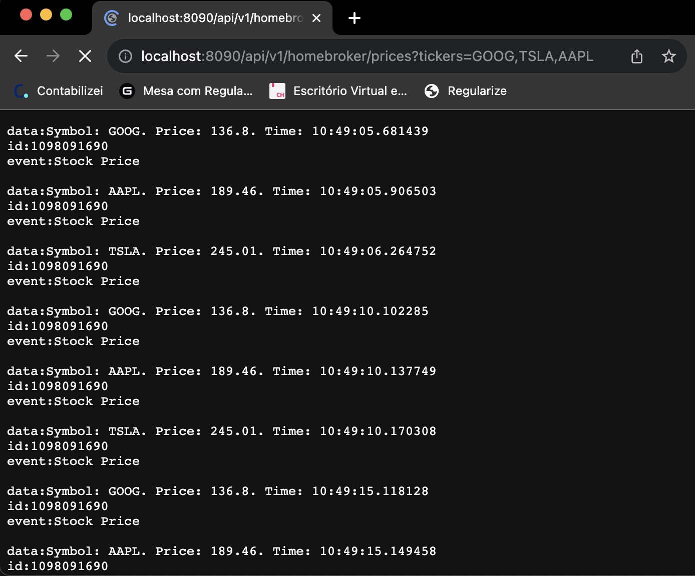

# Homebroker
Sample homebroker application which supports multiple client requests for stock prices using Server-Sent Events protocol.

## Dependencies
This is a Spring Boot application developed using Java version 11 and Maven as dependency manager and build tool.

## Instalaltion
After clone the application's source code, execute the command below
to build the application and generates the java executable artifact

In the application's root directory:
```js
cd  ./homebroker
mvn clean package
```

## Execution
After successfully compiling the code, you can run the application using the commands below:
(considering the jar file inside target directory created on build)
```
java -jar target/homebroker-0.0.1-SNAPSHOT.jar
```

## Running
The application will constantly run a scheduled stock prices notifier for the subscribed clients and tickers. The default schedule delay time is 5s, wich can be modified [here](src/main/java/com/ghgs/homebroker/market/StocksObserver.Java).

```
2023-09-04 11:09:26.056  INFO 91324 --- [   scheduling-1] c.ghgs.homebroker.market.StocksObserver  : Starting Market feeder.
2023-09-04 11:09:31.061  INFO 91324 --- [   scheduling-1] c.ghgs.homebroker.market.StocksObserver  : Starting Market feeder.
2023-09-04 11:09:36.066  INFO 91324 --- [   scheduling-1] c.ghgs.homebroker.market.StocksObserver  : Starting Market feeder.
```

## Subscribe to homebroker
To start receiving stock prices notification, just request the following URL in a web browser. A list of tickers can be requested in the same URL:


One Ticker
```
http://localhost:8090/api/v1/homebroker/prices?tickers=GOOG
```

Three Tickers
```
http://localhost:8090/api/v1/homebroker/prices?tickers=GOOG,TSLA,AAPL
```

You will start receiving in our browser the prices notifications for the stocks requested:



You can open several browsers with different list of tickers to see each client receives it's specfic stock price accordingly to the request.

## Observer Pattern

To achieve multithreading processing of the stock prices notifications, it's used the Observer design pattern alongside the Server-Sent Events protocol to stabilish persistent connections between the client and server.
We can see in the logs the notifications being sent in different threads:

```
2023-09-04 10:54:00.368  INFO 91324 --- [ol-1-worker-345] c.ghgs.homebroker.market.StocksObserver  : Notifying Client: 9211dc68-0e22-470d-8abe-0adf57fe1b00. Stock: GOOG
2023-09-04 10:54:00.703  INFO 91324 --- [ol-1-worker-345] c.ghgs.homebroker.market.StocksObserver  : Notifying Client: 9211dc68-0e22-470d-8abe-0adf57fe1b00. Stock: AAPL
2023-09-04 10:54:00.908  INFO 91324 --- [l-1-worker-1795] c.ghgs.homebroker.market.StocksObserver  : Notifying Client: 9211dc68-0e22-470d-8abe-0adf57fe1b00. Stock: TSLA
```
